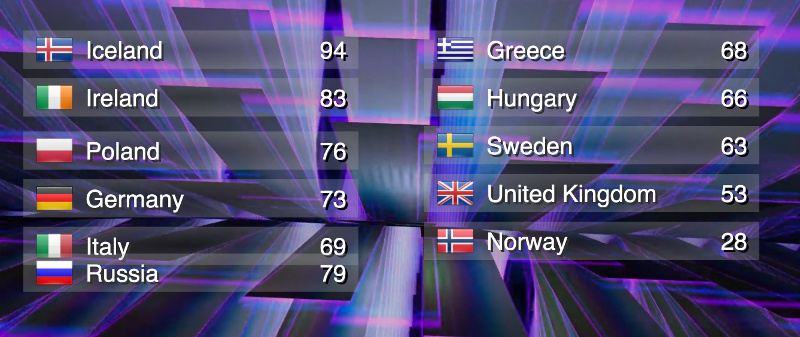

# Description

This project is for the purpose of live productions of 
[Song Contest – the Almost Eurovision Experience](http://www.songcontest-musical.com/)
to display voting, count-down and live-crosses.

This is a HTML page for full-screen display in a web browser with
scripting to update the votes and transition between some of the modes
needed during the show.

[Live Preview](https://cdn.rawgit.com/nigels-com/eurovision/master/index.html)

# Instructions

1. Clone from github: `$ git clone https://github.com/nigels-com/eurovision.git`

2. Change directory: `$ cd eurovision`

3. Run the web server: `$ python MultithreadedSimpleHTTPServer.py`

4. Browse to: [http://localhost:8000/index.html](http://localhost:8000/index.html)

5. Adjust votes at the CLI: `$ bin/vote.py -c Iceland -v +10`

# Keyboard Controls

  - **1** Show Votes
  - **2** Hide Votes
  - **3** Show Background
  - **4** Hide Background
  - **Space** Pause Video

# Acknowledgements

Background video courtesy of [Amitai Angor/AA-VFX](http://director-editor.coi.co.il/), 
[@YouTube](https://www.youtube.com/watch?v=ZGUsPUrOB0E),
[@Facebook](https://www.facebook.com/AAvfx).

National flags courtesy of [Go Squared](https://www.gosquared.com),
[2600 Flag Icon Set](https://www.gosquared.com/resources/flag-icons/)

Python multi-threaded web server: [Nakiami/MultithreadedSimpleHTTPServer](https://github.com/Nakiami/MultithreadedSimpleHTTPServer).
